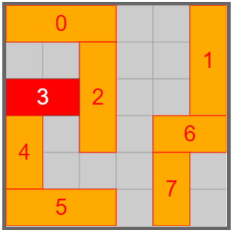

# rush-hour-solver
Solver for Unblock Me / Rush Hour style puzzle games in JavaScript.   
Original script: https://gist.github.com/jackhftang/82a206fddcfc666934650aaf760457ee

Install
======
You can install with `npm`

    $ npm install rush-hour-solver

Using
======
Let's solve the following game:



```javascript
import rushHourSolver from 'rush-hour-solver';

const blocks = [
  {
    length: 3,
    position: [0, 0],
    direction: 'H'
  },
  {
    length: 3,
    position: [0, 5],
    direction: 'V'
  },
  {
    length: 3,
    position: [1, 2],
    direction: 'V'
  },
  {
    length: 2,
    position: [2, 0],
    direction: 'H',
    isTarget: true
  },
  {
    length: 2,
    position: [3, 0],
    direction: 'V'
  },
  {
    length: 3,
    position: [5, 0],
    direction: 'H'
  },
  {
    length: 2,
    position: [3, 4],
    direction: 'H'
  },
  {
    length: 2,
    position: [4, 4],
    direction: 'V'
  }
];

const game = new rushHourSolver.Game({ size: 6, blocks: blocks });
```

You can then check that the game is represented correctly:

```
>>> game.matrix
[
   ['A', 'A', 'A', '.', '.', 'B']
   ['.', '.', 'C', '.', '.', 'B']
   ['+', '+', 'C', '.', '.', 'B']
   ['E', '.', 'C', '.', 'G', 'G']
   ['E', '.', '.', '.', 'H', '.']
   ['F', 'F', 'F', '.', 'H', '.']
]

OR

>>> game.map
AAA..B
..C..B
++C..B
E.C.GG
E...H.
FFF.H.
```

`rushHourSolver.solve` will return the steps of moving blocks to solve:
```javascript
const solution = rushHourSolver.solve(game);
```

```
>>> solution
[
    {
        block: 6,
        map: "AAA..B\n..C..B\n++C..B\nE.CGG.\nE...H.\nFFF.H.",
        position: [3, 3]
    },
    {
        block: 1,
        map: "AAA...\n..C..B\n++C..B\nE.CGGB\nE...H.\nFFF.H.",
        position: [1, 5]
    },
    ...
]
```
